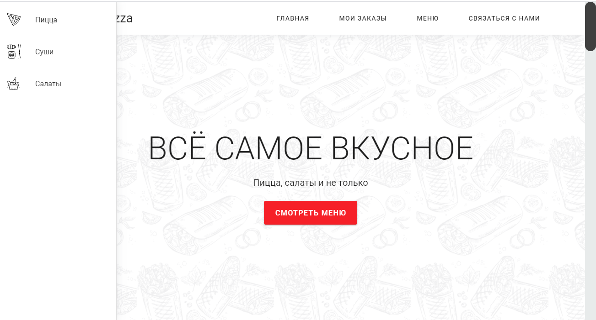

# Pizza app
I have developed the app, using laravel and vuejs. User has an opportunity to order the variety of dishes. Also one has an access to an admin panel.  

User can:
* view orders
* change orders
* delete orders
* add orders

Also there is the admin panel, which is available only for super user (`http://127.0.0.1:8000/admin`). To become the privilege user, you need change the user status from `user` to `admin` in the table, named `laravel_user` or log in as user with email `adminadmin1@gm.com` and password `adminadminadmin1`

## Screenshots

> The admin panel for a user

> The list of products

> Product description

> Home page

> Login page for the super admin

## How to run the app
Firstly, you need create .env file and fill in your database settings. Then open terminal or type
* npm install
* composer install
* php artisan migrate
* php artisan serve

If you 